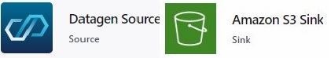
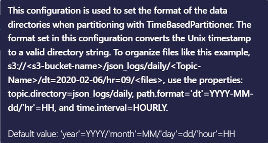
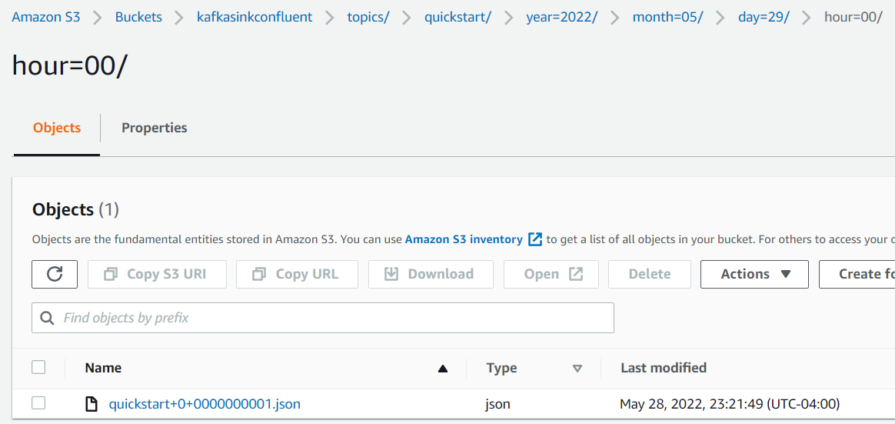
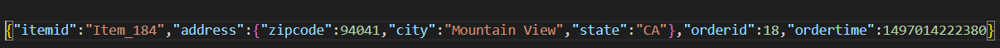

# 100DaysOfCode_ApacheKafka
#100daysofcode challenge - Confluent Kafka challenge which I believe  will be an exciting journey into the world of Apache Kafka with Confluent!

I am taking this challenge for the following important reasons.

- Habit - By committing to this challenge I want to make coding a habit which will bring about a change to my life as any habit would do.
- Accountability - Make myself accountable to post updates on a daily basis and ensure I do not break the habit.
- Inspiration - There have been few friends and mentors in Linkedin who have inspired me to take this challenge and possibly by the end of this challenge I wish I inspire few others.
- Real-Time event based Projects - Would love to Identify problems which would need Real-time event based  Engineering solutions, and work on solving them.

https://developer.confluent.io/100-days-of-code/

# Day #01 of #100daysofcode 

Today I signed up for Confluent Cloud and created the following from the Confluent Web Interface
- Confluent Kafka Cluster, 
- Created a Topic
- Produced a message to the Topic 
- Viewed the message on the Topic

**Kafka** - Event streaming platform used to collect, store and process real-time data streams, it can perform distributed logging, stream processing and pub-sub messaging.
 
**Events** - Things that have happened combined with a description of what happened and when it happened. It is captured as a Key, Value within Kafka
 
**Topic** - Is a category/feed name to which records are stored and published. All Kafka records are organized into topics. Producer applications write data to topics and consumer applications read from topics. Records published to the cluster stay in the cluster until a configurable retention period has passed by.
 
**Partitions** - A topic is divided into a number of partitions. The more partitions in a topic, the greater parallelization and throughput you will be able to achieve.
 
**Message** - It is a combination of Key and Value, where the value follows a structure (as captured within Kafka) and represents a application domain object or some form a raw message. Keys can be complex domain objects but often are primitive data types such as strings or integers.
 
**Key** - Is not a primary key or a unique identifier of the message while it represents a identifier of some entity of the system like a user, order or a particular connected device.

**Day #02 of #100daysofcode – Confluent Kafka**

Today I used the Kafka cluster in the Confluent Cloud and performed the following from the Confluent Web Interface
- Created a **Source (Connector) – DatagenSourceConnector 
- Created a **Sink (Connector) – AWS S3 Sink
- Generated messages from the Source and Produced them to the Topic (name: quickstart)
- Viewed the message stored in the Topic within the Kafka Broker
- Read the messages from the Topic and **Consumed** them to ingest to S3 Sink

 Day #03 of #100daysofcode – Confluent Kafka

Today I analyzed the object stored in the S3 Bucket (Kafka  Sink). 
Sample message: JSON format
{
  "ordertime": 1505266540190,
  "orderid": 24,
  "itemid": "Item_233",
  "orderunits": 6.344119191980837,
  "address": {
   	"city": "City_81",
   	"state": "State_91",
   	"zipcode": 50785
}
}

Sink Settings: 
Data to be ingested into the S3 Sink is organized by Time Interval: Daily
Partitioning interval of data, accordingly to the time ingested to storage.

