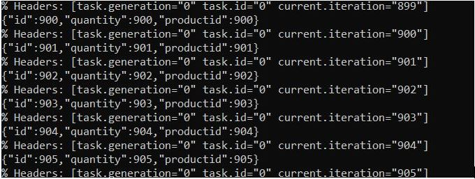
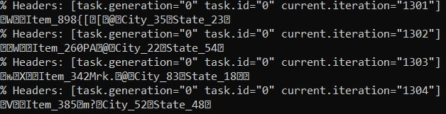
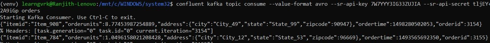

**Day #06 of #100DaysOfCode @ApacheKafka**

Today I was able to understand a bit more about Kafka’s features
1.	Brokers
-	A computer, instance, or container running Kafka process
-	Manager Partitions
-	Handle write and read requests
-	Manager replication of partitions
2.	Replication
-	Copies of data for fault tolerance
-	One lead partition and N-1 followers
-	Writes and reads happen to the same leader
-	An invisible process to most developers.
-	Tunable in the Producer
3.	Producers
-	Client application
-	Puts messages into topics
-	Connection pooling
-	Network buffering
-	Partitioning
4.	Consumers
-	Client application
-	Gets message from topics
-	Group of Consumers logically belong to the Consumer Group
-	Messages can be read multiple times with the knowledge of the record’s offset
-	Typically, number of Consumers in a Consumer group is equal or lesser than the number of partitions of a Topic.
-	Two consumers cannot read the same partition of a given Topic.
-	One consumer can read from more than one Partition of a given Topic.

**Day #07 of #100DaysOfCode @ApacheKafka**

Today I was able to read the messages in the topic: poems through a Consumer which was created using a custom code written in Python (consumer.py)

Steps for the following
-	Create a config file which contains details to 
o	Establish default connection to the Kafka Cluster
o	Define the Consumer group and set the message pointer default position on reset.
-	Create a custom script for Consumer
-	Run the consumer script through CLI to view the messages stored in the Topic.

https://developer.confluent.io/learn-kafka/apache-kafka/consumers-hands-on/

Install pip, virtualenv in Unix Environment
https://gist.github.com/frfahim/73c0fad6350332cef7a653bcd762f08d

**Day #08 of #100DaysOfCode @ApacheKafka**

Today I was able to learn about the one of the Kafka’s ecosystem components which is called Kafka Connect and its significance in using Kafka to solve real-world use cases. In short it can be understood as Kafka’s Integration API.

Kafka Connect includes two types of connectors:
Source connector – Ingests entire databases and streams table updates to Kafka topics. A source connector can also collect metrics from all your application servers and store these in Kafka topics, making the data available for stream processing with low latency.
Sink connector – Delivers data from Kafka topics into secondary indexes such as Elasticsearch, or batch systems such as Hadoop for offline analysis.

**Day #09 of #100DaysOfCode @ApacheKafka**

Today I was able to create a Topic in an existing Kafka cluster and perform the following.
-	Create a Kafka Source Connector API and send messages to the broker
-	Confluent Kafka Web Interface provides sample message templates and file format for users to test the data flow.
-	Create a Console Consumer using a CLI instance of and consume the messages.

**Day #10 of #100DaysOfCode @ApacheKafka**

Today I was able to understand the basics of Confluent Kafka Schema Registry. Schema Registry provides a way to store the schema of the message which is produced and sent to Kafka brokers. 
•	Setup the Schema Registry, from the Schema Registry landing page
•	Create a Topic and setup a Connector with generates a default message template with an output value format stored in an AVRO format.
•	Once the connector gets initialized, and starts generating messages.
•	Messages are serialized and stored in AVRO format.
•	Create a Console Consumer and read the messages from beginning, the data displayed is in serialized format.
•	Create another Console consumer with an API key and API secret and output value format as AVRO.

 

