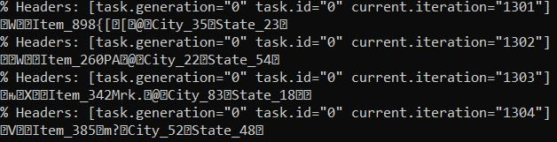
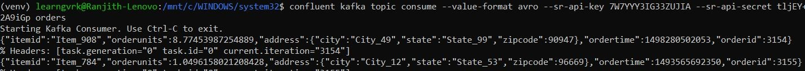
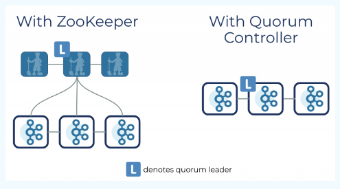

**Day #11 of #100DaysOfCode @ApacheKafka**

Today I was able to view the messages which are stored in the Kafka topic in AVRO format. The messages can be viewed in serialized and de-serialized format.

Serialized
/mnt/c/WINDOWS/system32$ confluent kafka topic consume --from-beginning orders
% Headers: [task.generation="0" task.id="0" current.iteration="0"]
W Item_897K9 L#@City_62State_87

De-serialized
/mnt/c/WINDOWS/system32$ confluent kafka topic consume --value-format avro --sr-api-key <API-KEY> --sr-api-secret <API-SECRET-KEY> orders
% Headers: [task.generation="0" task.id="0" current.iteration="3264"]
{"orderid":3265,"itemid":"Item_915","orderunits":6.31336356075099,"address": {"city":"City_15","state":"State_17","zipcode":12982},"ordertime":1507846961312}

**Day #12 of #100DaysOfCode @ApacheKafka**

Today I was able to create a ksqlDB cluster and consume messages from Kafka cluster, create a kafka stream to perform transformations and table to perform aggregations from stream output.
1.	Create a Topic – Orders
2.	Enable Schema Registry for this topic which automatically creates a schema (with version) 
3.	Create a Connector – Kafka Connect – DataGenSource 
a.	Generate Orders data (Template Schema) events messages
b.	Saves data in Kafka Topics/Partitions in AVRO format
c.	Data is serialized format when saved.
d.	Can be de-serialized to be viewed through a Console Consumer (Confluent Kafka CLI)
4.	Use ksqlDB to perform transformations and aggregations on the data stored in the topics
a.	Create a Data Stream while reading the data from the topic/partitions
i.	Provide the topic name, message format, timestamp, number of partitions
b.	Create another stream on the above stream with transformations
i.	Convert epoch seconds to Time format (MM/DD/YYYY HH:MM:SS)
ii.	Convert Address Struct datatype to primitive data type fields
c.	Create a Data Table which performs aggregations, and this table is appended constantly
First Stream
CREATE STREAM orders_stream WITH (
	KAFKA_TOPIC = ‘orders’,
	VALUE_FORMAT = ‘AVRO’,
	PARTITIONS= 6,
	TIMESTAMP = ‘ordertime’
);

Second Stream
CREATE STREAM orders_stream_ts AS
	SELECT 
	TIMESTAMPTOSTRING (ORDERTIME, ‘MM-dd-yyyy hh:mm:ss.SSS’) as ORDERTIME_FORMATTED,
	orderid,
	itemid,
	orderunits,
	address->city,
	address->state,
	address->zipcode
	FROM orders_stream
	EMIT CHANGES;

Create Aggregated Table
CREATE TABLE STATE_COUNTS AS 
SELECT address  state,
COUNT_DISTINCT (orderid) as DISTINCT_ORDERS
FROM orders_stream
WINDOW TUMBLING (SIZE 7 DAYS)
GROUP BY address  state;

TABLE AGGREGATIONS
select * from STATE_COUNTS 
WHERE distinct_orders > 2;

**Day #13 of #100DaysOfCode @ApacheKafka**

Today I went through the developer pages about Apache Kafka Raft (KRaft). It is the consensus protocol that was introduced to remove Apache Kafka’s dependency on ZooKeeper for metadata management. This greatly simplifies Kafka’s architecture by consolidating responsibility for metadata into Kafka itself, rather than splitting it between two different systems: ZooKeeper and Kafka. KRaft mode makes use of a new quorum controller service in Kafka which replaces the previous controller and makes use of an event-based variant of the Raft consensus protocol.

Source: https://developer.confluent.io/learn/kraft/

**Day 14 - Added Producer client using Python client file**
(venv) learngvrk@Ranjith-Lenovo:/mnt/c/Users/Owner/Documents/kafka/100DaysOfCode_ApacheKafka/Day06-10$ ./producer.py config.ini\
Produced event to topic purchases: key = jsmith       value = book\
Produced event to topic purchases: key = htanaka      value = book\
Produced event to topic purchases: key = jbernard     value = alarm clock\
Produced event to topic purchases: key = jsmith       value = t-shirts\
Produced event to topic purchases: key = jsmith       value = t-shirts\
Produced event to topic purchases: key = awalther     value = alarm clock\
Produced event to topic purchases: key = sgarcia      value = alarm clock\
Produced event to topic purchases: key = sgarcia      value = batteries\
Produced event to topic purchases: key = htanaka      value = t-shirts\
Produced event to topic purchases: key = eabara       value = t-shirts\

**Run a Producer or Consumer script from CLI (Linux Terminal/WSL)** \
https://developer.confluent.io/learn-kafka/apache-kafka/consumers-hands-on/ \
Ensure that Python 3, pip, and virtualenv are installed on your machine. If they’re not, check out the prerequisites from the getting started with Python guide. \
From a terminal window, activate a new virtual environment and install the confluent-kafka library. \
$ virtualenv env \
$ source env/bin/activate \
$ pip install confluent-kafka \

Determine your cluster endpoint by running: \
$ confluent kafka cluster describe

You need an API key and secret in order to proceed. If you need a new one, make note of the cluster ID that was printed in step 3 and use it to run: \
confluent api-key create --resource {ID} \
Then set the key using: \
confluent api-key use {API Key} --resource {ID} \

Make the script executable and run: \
chmod u+x consumer.py \
./consumer.py config.ini

**Day #15 of #100DaysOfCode @ApacheKafka**

Today I have decided to work on a simple real-time pipeline to identify possible fraud credit card transactions, as part of anomaly deduction.

As part of this simple pipeline, need to create a producer client application using python. The credit card transaction event is captured as a JSON key: value pair.  
{cc_num: <credit card number>, trans_ts: <transaction_timestamp>}. 
The Producer message {Key, Value} pair would be “card_type”, {JSON string}

Topic: cc_transactions
Sample message: 
Produced event to topic cc_transactions: key = “visa”  value = {"cc_num":34643,"trans_ts":2022-04-01 10:30:45.333"}
Producer client: cc_producer.py

https://github.com/ranjithpals/100DaysOfCode_ApacheKafka/blob/16c9c0135ff16a92bb15813d9330d6f20d1f9449/Day11-15/cc_producer.py

