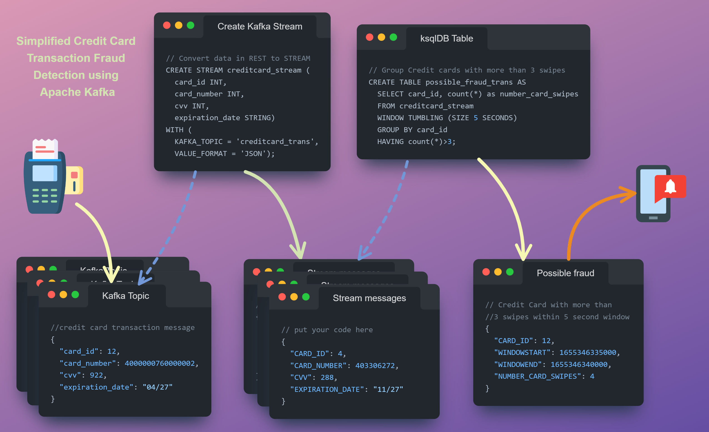
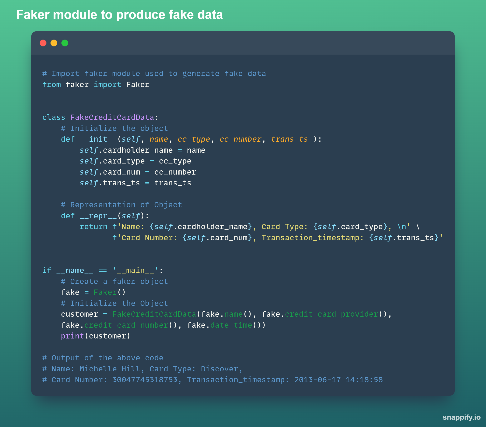

**Day #16 of #100DaysOfCode @ApacheKafka**

Today when I was working on the message needed to be produced by the Kafka producer application for the application I am planning to build, I understood the need to convert the string values to JSON format. 
Since each Kafka message is a stream of bytes (raw message), we need to ensure this message follows a certain structure, which helps to process the message effectively and also enable version control of the schema. 
While constructing a JSON string, simple string concatenation does not work and we need special formatting. Ex. 
JSON formatted value (key, value) part of the Kafka message:
{"cc_num": 22225, "trans_ts": '2022-04-01 10:30:55.555'}
JSON string to be constructed in Producer application: 
"{\"cc_num\":22225, \"trans_ts\":'2022-04-0110:30:55.555'}"
I found the following website which helped me in constructing this message in my producer application: https://jsontostring.com/

**Day #17 of #100DaysOfCode @ApacheKafka**
Today when I was working on converting the producer application which was providing the messages in a small batch versus providing to a stream of the messages. 
This is to enable creating a Kafka Stream and perform aggregations on this stream and store the results in a table.

**Day #18 of #100DaysOfCode @ApacheKafka**
Today I stumbled upon the faker module which is very easy to use and provides an easy way to produce fake data which produces unique mock values and has multiple Standard Providers.
Documentation: https://faker.readthedocs.io/en/master/providers/faker.providers.credit_card.html

**Day #19 of #100DaysOfCode @ApacheKafka**

Today I was able to create a very simplified version of a real-time event driven data pipeline using ksqlDB in Apache Kafka.
1.	Created ksqlDB cluster with cluster size = 2
2.	Create a stream of messages read from the topic 
3.	Create a table from the stream (applying some filters and aggregations). This table is appended dynamically as more data is received by the stream.

 
**Day #20 of #100DaysOfCode @ApacheKafka**
Today I tried improving the Custom Producer script using Faker module.
1.	Card Type – Default to ‘visa’ 
2.	Card Number – Credit card number
3.	Security code – cvv code
4.	Transaction time – used the expiration date function from Credit Card provider class with the required format and datetime window as parameters 	
a.	(start='now', end='+1m', date_format="%m-%d-%y %H: %M: %S")
5.	Produce a maximum of 50 messages.

