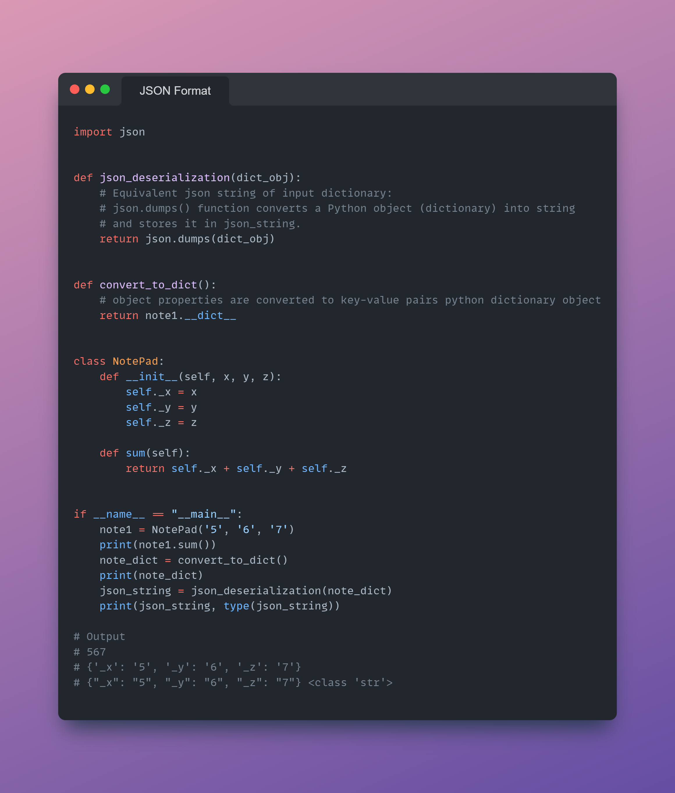
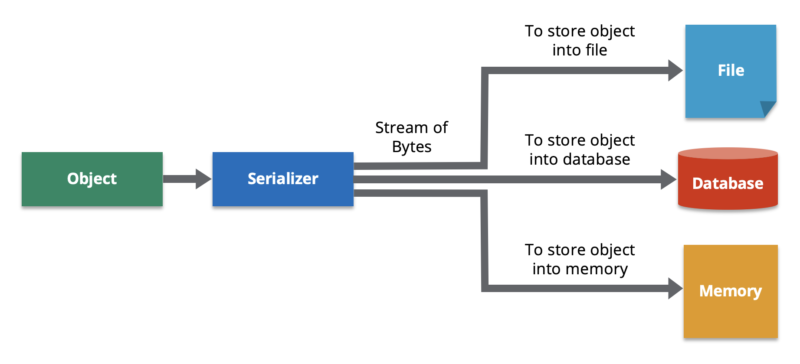
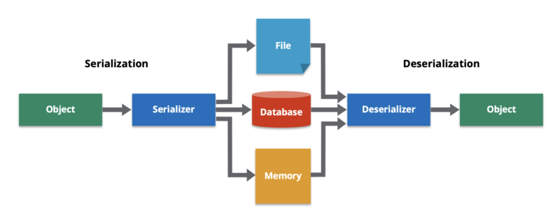

**Day #21 of #100DaysOfCode @ApacheKafka**
Today I improved the Custom Producer script by changing the following since the previous version.
1.	Multiple card swipes for the same card – using the fake module directly to generate transactions, there weren’t multiple transactions of a given credit card which is critical to our case which involves detecting anomaly due to card swipes within a short time frame.
2.	Card Number & Card security code sync – A given credit card should have the same security code, which does not occur when using fake module directly, so I created a helper function which generates card number, security codes and associates them within a dictionary. The function is parameterized where we can select the number of cards we would want to see as part of our transactions.
3.	Generate transactions using card details in sync – From the dictionary mentioned above, using the choice method from random module the card number from a select set of card numbers and the corresponding security codes can be generated.
4.	Generate continuous stream of transactions (limitless) – Using the While loop, checking for Boolean=True was able to generate a continuous stream of card transactions.
https://github.com/ranjithpals/100DaysOfCode_ApacheKafka/blob/main/Day21-30/mockdata_card_transactions.py

**Day #22 of #100DaysOfCode @ApacheKafka**
Today I was trying to convert the object properties into dictionary, and then convert the dictionary to JSON string (deserialize). 
I would be using the concept in my credit card transaction producer application script.

**Day #23 of #100DaysOfCode @ApacheKafka**
Today I spent time going through this very informative, easy to understand article explaining the concept of serialization and de-serialization of data objects,
why and where it is needed in the distributed data systems space.
What is serialization and how does it work? | Credit: Hazelcast

https://hazelcast.com/glossary/serialization/

**Day #24 of #100DaysOfCode @ApacheKafka**
Today I was able to install the Confluent Kafka CLI which is needed to run Client Applications (Producer/Consumer) 
written in any of the Programming languages (Python in my case).

https://docs.confluent.io/confluent-cli/current/install.html#cli-install

On Windows, you might need to install an appropriate Linux environment to have the curl and sh commands available, 
such as the Windows Subsystem for Linux. You can also download and install the raw binaries.

**Day #25 of #100DaysOfCode @ApacheKafka**
Today I was able to run the following commands for Confluent Cluster from the CLI. 
$:/mnt/c/WINDOWS/system32$ confluent environment list

       ID      |  Name
---------------+----------
  * env-o337dy | default

- $:/mnt/c/WINDOWS/system32$ use env-o337dy
- $ confluent environment use env-o337dy
Now using "env-o337dy" as the default (active) environment.
- $:/mnt/c/WINDOWS/system32$ confluent kafka cluster list

       Id      |      Name      | Type  | Provider |  Region   | Availability | Status
---------------+----------------+-------+----------+-----------+--------------+---------
    lkc-7y5jyj | DemoCluster_01 | BASIC | aws      | us-east-1 | single-zone  | UP

- $:/mnt/c/WINDOWS/system32$ confluent kafka cluster use lkc-7y5jyj
Set Kafka cluster "lkc-7y5jyj" as the active cluster for environment "env-o337dy".
- $:/mnt/c/WINDOWS/system32$ confluent api-key create --resource lkc-7y5jyj

- $:/mnt/c/WINDOWS/system32$ confluent api-key use XXXXXXXXXXXXXXXXX --resource lkc-7y5jyj
Set API Key "XOXWP6VDE5SU2NKO" as the active API key for "lkc-7y5jyj".
- $ confluent kafka topic list

  Name
---------
  poems

