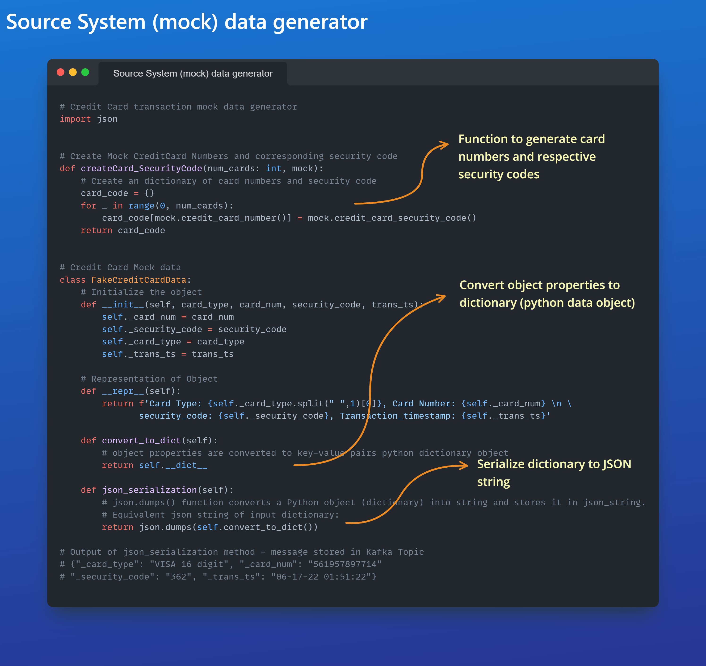
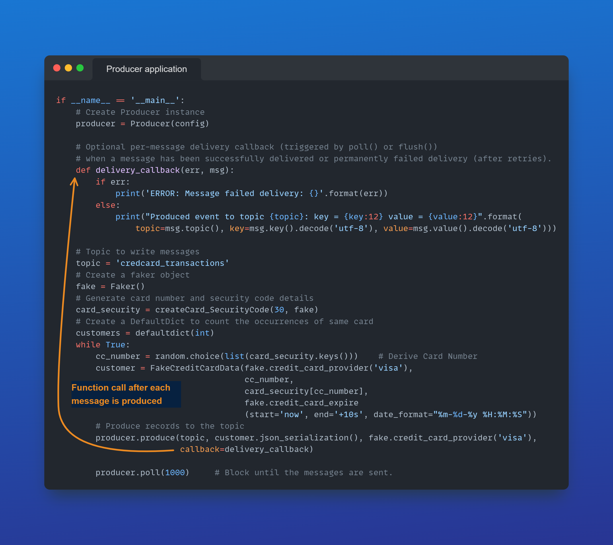
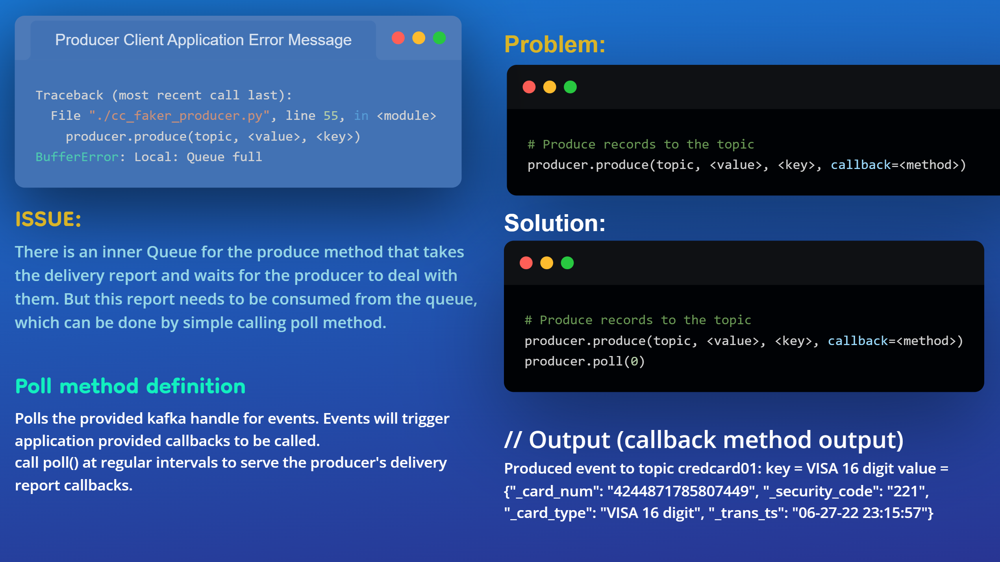

**Day #26 of #100DaysOfCode @ApacheKafka**
Today I was able to complete creating my first custom Producer Source System data generator/application (mockdata_card_transactions.py) and the Kafka Producer 
(cc_faker_producer.py) using the Faker library. Below is the mock data generator/application code which I was able to unit test successfully.

**Day #27 of #100DaysOfCode @ApacheKafka**
Today I was able to run the custom Producer client application in the Kafka cluster and messages sent to a topic with four partitions. 
Below is the part of the producer script.

**Day #28 of #100DaysOfCode @ApacheKafka**
Today I spent time resolving the issue which came up when I ran the credit card transaction client application in the Kafka cluster. 
Below is a brief on the issue and its solution.
Credits: https://stackoverflow.com/questions/62408128/buffererror-local-queue-full-in-python

**Day #29 of #100DaysOfCode @ApacheKafka**
Today I spent time understanding and using the Producer configuration: linger.ms. 
The producer groups together any records that arrive in between request transmissions into a single batched request. Subsequent requests are spaced between the specified time (ms).
-	Normally this occurs only under load when records arrive faster than they can be sent out. 
-	However, in some circumstances the client may want to reduce the number of requests even under moderate load. 
- This setting accomplishes this by adding a small amount of artificial delay—that is, rather than immediately sending out a record, 
the producer will wait for up to the given delay to allow other records to be sent so that the sends can be batched together.

https://docs.confluent.io/platform/current/installation/configuration/producer-configs.html
 
**Day #30 of #100DaysOfCode @ApacheKafka**
Today I spent time understanding the effect of using the below attributes in the Producer application while acknowledging the messages sent to cluster.
-	Producer configuration: linger.ms=<t>ms
-	Producer method: poll(n)
- Scenario 1: If poll parameter is equal to zero (n = 0) and linger.ms is greater than zero
The poll method gains precedence, the delivery report is received by the producer application instantaneously (without any delay) 
  irrespective of the linger.ms which actually dictates the time before the next batch of messages is sent to the Producer.
- Scenario 2: If poll parameter is greater than zero (n > 0) and linger.ms is greater than zero
The linger.ms configuration (ms) gains the precedence, and hence the delivery callback method is invoked only after the time (ms) is lapsed. 
  This behavior does not change no matter the value of the poll parameter.
