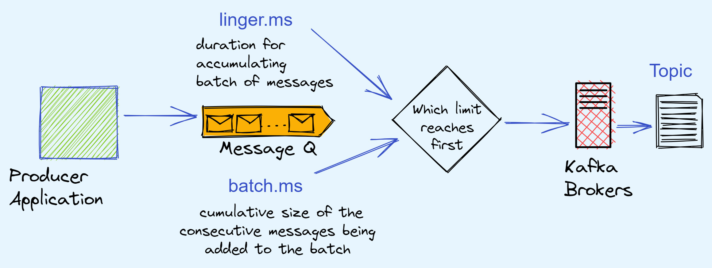
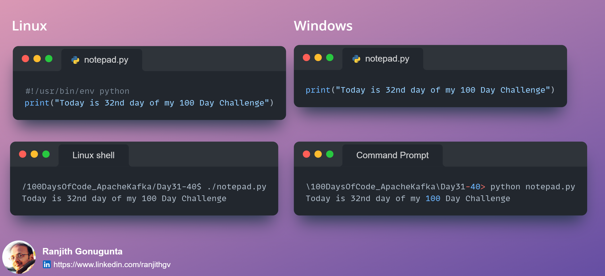

**Day #31 of #100DaysOfCode @ApacheKafka**
Today I spent time understanding the effect of using the below attributes in the Producer application with respect to delivering the messages in batches to the topic(partitions) in Kafka brokers.
-	Producer configuration: linger.ms=<t in ms>
-	Producer configuration: batch.size=<n in bytes>
The Producer delivers the messages in batches, the number of messages delivered in the batch depends upon whichever happens first
1.	Batch size - cumulative size of the consecutive messages being added to the batch until it reaches the value mentioned in the batch.size
2.	Batch duration – Time duration specified in linger.ms until which the producer queues up the messages produced.

**Day #32 of #100DaysOfCode @ApacheKafka**
Today while creating a python script to be run in a Linux environment (typically when working on an edge node or nodes of a cluster) I realized that we have to constantly remember the below, especially developers who often switch between working on windows and Linux operating systems.
-	Include the python installation directory as first line of the script - #!/usr/bin/env python
-	To run the script from the shell - ./filename.py

